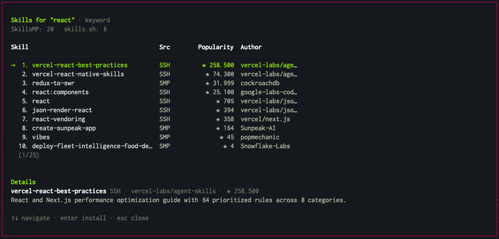

# pi-find-skills

A [pi coding agent](https://github.com/badlogic/pi-mono) extension for discovering and installing AI agent skills from multiple marketplaces.



## What is this?

**pi-find-skills** lets you search, discover, and install skills for your AI coding agent directly from within pi. Instead of manually browsing skill marketplaces, you can find and install skills using natural language or slash commands.

**Skills** are reusable prompt templates, workflows, and capabilities that extend what your AI agent can do. For example:
- "How do I deploy to Cloudflare?" → finds and installs Cloudflare deployment skills
- "I need help with testing" → discovers TDD and testing skills
- "Set up a Neon database" → finds Neon/Postgres skills

This extension searches both [SkillsMP](https://skillsmp.com) and [skills.sh](https://skills.sh) simultaneously, so you get the best results from both platforms.


## Features

- ✍️ **Natural Language** - Just ask: "find skills for React" or "search skills for deploying to Vercel"
- 🌐 **Multi-Provider Search** - Queries SkillsMP and skills.sh in parallel
- 🔍 **Smart Ranking** - Results sorted by popularity (stars/installs)
- 📊 **Interactive UI** - Navigate results in a beautiful table with keyboard
- 📦 **One-Click Install** - Install any skill directly from the picker
- 🧰 **Agent Tool** - Exposes `skills_search` so the agent can find skills autonomously
- 💬 **Slash Commands** - `/skills search`, `/skills ai`, `/skills install`


## Quick Start

### Natural Language (Recommended)

Just talk to pi naturally:

```
find skills for web scraping
search skills for React components
I need a skill for AWS deployment
```

The extension intercepts these requests and shows matching skills from all providers.

### Slash Commands

```bash
/skills search <query>    # Keyword search across all providers
/skills ai <query>        # AI semantic search (requires SkillsMP)
/skills install <id>      # Install a skill by its ID
/skills                   # Show available commands
```


## Providers

| Provider | Auth | Description |
|----------|------|-------------|
| **[SkillsMP](https://skillsmp.com)** | API Key | Premium marketplace with AI-powered semantic search |
| **[skills.sh](https://skills.sh)** | None | Open marketplace, works out of the box |

Results are merged, deduplicated, and sorted by popularity.


## Configuration

### SkillsMP (Optional)

SkillsMP requires an API key. skills.sh works without any configuration.

1. Go to [SkillsMP](https://skillsmp.com/auth/login)
2. Sign in and generate an API key
3. Add to your shell profile:

```bash
export SKILLSMP_API_KEY="sk_live_your_key_here"
```

```bash
source ~/.zshrc  # or ~/.bashrc
```


## How It Works

Once loaded, the extension adds three capabilities to pi:

1. **Input Interception** - Detects when you're looking for skills in natural language
2. **Slash Commands** - Provides `/skills` commands for direct control
3. **Agent Tool** - Gives the agent access to `skills_search` so it can find skills when you ask questions like "is there a skill for X?"


## License

MIT
